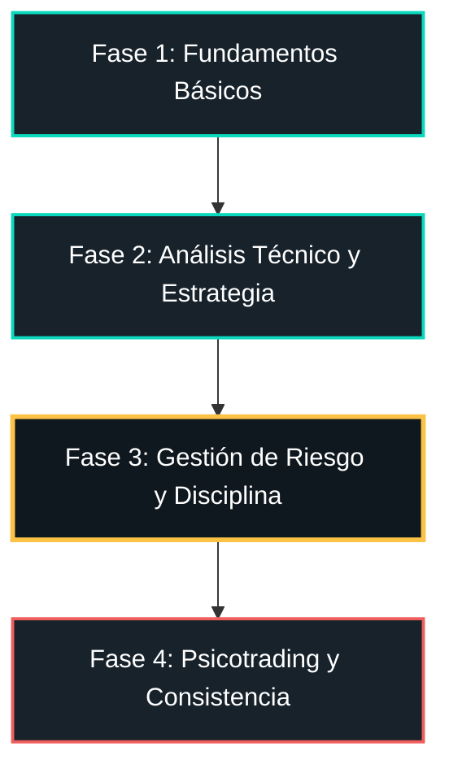

# Temario de Visión Trading Pro: Trading sin Humo ni Atajos
## Estructura Completa y Profesional del Curso (De Principiante a Avanzado)

Este temario ha sido diseñado bajo una estricta filosofía de **realismo operativo**, alineado con la visión de un trader institucional con 10 años de experiencia. El objetivo principal es educar al alumno desde cero, eliminando cualquier expectativa de dinero rápido, y guiándolo hacia una mentalidad de gestión de riesgo, probabilidad y consistencia estadística.

---

## 🗺️ Resumen de la Estructura por Fases

*   **Fase 1: Fundamentos Básicos (De Cero a Operador Consciente)**: Comprender la infraestructura real del mercado financiero, los activos clave (SPY, Nasdaq, Oro) y la mecánica transaccional.
*   **Fase 2: Análisis Técnico y Estrategia (Nivel Intermedio)**: Aprender a leer la acción del precio y el flujo de órdenes real, evitando trampas algorítmicas y chartismo de masas.
*   **Fase 3: Gestión de Riesgo y Disciplina (El Núcleo del Curso)**: Dominar las matemáticas operativas de la supervivencia, el cálculo exacto de posición y la planificación profesional.
*   **Fase 4: Psicotrading y Consistencia (Nivel Avanzado)**: Forjar la psicología estadística, la gestión de drawdown y el proceso de auditoría para operar profesionalmente.

---

## 📦 FASE 1: Fundamentos Básicos (El Negocio Real)
*Objetivo: Cimentar el conocimiento teórico del alumno sobre bases sólidas y realistas. Eliminar la perspectiva de "juego de azar" y presentar el trading como un negocio financiero de distribución de capital.*

### Módulo 1: La Estructura de la Industria Financiera
*   **Clase 1.1: ¿Qué es realmente el Trading Profesional?**
    *   *Descripción:* El trading como negocio de especulación financiera. Explicación de la expectativa de retornos reales (3% - 10% mensual) vs. las promesas falsas de la publicidad retail.
    *   *Enfoque Sin Humo:* Desmitificación del "trader de playa" y el estilo de vida de lujo instantáneo. Enfoque en el trabajo de oficina, la paciencia y el análisis.
*   **Clase 1.2: Participantes del Mercado y Flujo de Capital**
    *   *Descripción:* Quiénes mueven el mercado. Bancos Centrales (FED, BCE, BOJ), Creadores de Mercado (Tier 1 Banks como JPMorgan y Citi), Fondos de Cobertura (Hedge Funds) y el rol insignificante del trader minorista.
    *   *Enfoque Sin Humo:* Aprender a entender que no "manipulan contra ti individualmente", sino que los algoritmos institucionales buscan grandes zonas de liquidez para sus operaciones multimillonarias.
*   **Clase 1.3: Foco Operativo: SPY, Nasdaq (QQQ) y Oro (XAUUSD)**
    *   *Descripción:* Análisis profundo del ecosistema de los tres activos principales. Horarios de volumen, firmas algorítmicas y por qué elegimos estos activos de alta liquidez frente a criptomonedas exóticas o acciones de centavo ("penny stocks").
*   **Clase 1.4: La Infraestructura del Brokerage (ECN/STP vs. Market Makers)**
    *   *Descripción:* Cómo operan las mesas de ejecución. Brokers A-Book (STP/ECN) que pasan las órdenes al mercado vs. Brokers B-Book (Creadores de mercado) con conflicto de interés. Regulaciones seguras (FCA, ASIC).
    *   *Enfoque Sin Humo:* Enseñar que la elección del broker y el coste transaccional (spread + comisiones) pueden arruinar una estrategia ganadora a largo plazo.
*   **Clase 1.5: Mecánica de Órdenes y Libro de Órdenes**
    *   *Descripción:* Cómo se cruza el precio. Bid, Ask, Spread, Slippage. Tipos de órdenes operativas: Órdenes a Mercado, Órdenes Límite y Órdenes Stop (Stop Loss y Take Profit).

### Módulo 2: Interpretación del Gráfico y Plataformas
*   **Clase 2.1: Configuración de la Terminal de Análisis (TradingView)**
    *   *Descripción:* Tour práctico por TradingView. Configuración limpia de plantillas, listas de seguimiento, herramientas de dibujo esenciales y alarmas de precio.
*   **Clase 2.2: Lectura de Velas Japonesas y Flujo de Órdenes Implícito**
    *   *Descripción:* Anatomía de la vela. Qué representa el cuerpo y qué representan las mechas. Interpretación del volumen de transacciones que se oculta detrás de la representación visual.
*   **Clase 2.3: La Fractalidad del Tiempo (Multi-Timeframe)**
    *   *Descripción:* Introducción a las temporalidades. Gráficos Diarios/4H (Tendencia macro) vs. Gráficos de 15m/5m/1m (Zonas de ejecución y precisión).
*   **Clase 2.4: La Unidad de Medida: Pips, Puntos y Contratos**
    *   *Descripción:* Cómo medir la distancia en el precio. Diferencia entre pips en divisas, puntos en índices (Nasdaq/SP500) y dólares por onza en el Oro. Introducción conceptual al apalancamiento y el margen.

---

## 📈 FASE 2: Análisis Técnico y Estrategia (Nivel Intermedio)
*Objetivo: Enseñar al alumno a analizar el gráfico bajo la perspectiva institucional de la liquidez. Evitar el chartismo clásico masivo y aprender a identificar zonas de alta probabilidad basándose en el comportamiento real de los creadores de mercado.*

### Módulo 3: Acción del Precio y Estructura Real del Mercado
*   **Clase 3.1: Estructura de Tendencia Real (Swing Structure)**
    *   *Descripción:* Cómo se estructura una tendencia real sin indicadores. Mapeo de Altos más Altos (HH), Bajos más Altos (HL), Bajos más Bajos (LL) y Altos más Bajos (LH). Quiebre estructural inicial (CHoCH) y continuación (BOS).
*   **Clase 3.2: Zonas de Oferta y Demanda (Supply & Demand)**
    *   *Descripción:* El concepto institucional de "barato" y "caro" (Zonas Premium y de Descuento). Uso del retroceso de Fibonacci como herramienta de clasificación de rango operativo.
*   **Clase 3.3: Soportes y Resistencias Reales vs. La Trampa Minorista**
    *   *Descripción:* Por qué los soportes y resistencias obvios del chartismo clásico son las zonas donde más dinero se pierde. 
    *   *Enfoque Sin Humo:* Demostrar cómo las instituciones utilizan los stop losses acumulados por encima/debajo de estos niveles como liquidez para activar sus propias órdenes (Stop Hunts).
*   **Clase 3.4: Patrones de Velas de Confirmación Institucional**
    *   *Descripción:* Velas de rechazo (mechas largas) y velas envolventes en zonas Premium/Descuento. No operamos patrones de velas de forma aislada, sino bajo contexto.

### Módulo 4: Herramientas Técnicas y Fenómenos del Mercado
*   **Clase 4.1: Medias Móviles y su Rol en el Momentum (EMA 50/200)**
    *   *Descripción:* Cómo usar la EMA de 50 y la EMA de 200 periodos para identificar la tendencia macro y la velocidad del movimiento, no como señales automáticas de entrada.
*   **Clase 4.2: MACD y Volumen de Transacción Real**
    *   *Descripción:* Uso del oscilador MACD para identificar divergencias reales de momentum. Interpretación del volumen de transacciones para confirmar el interés de las instituciones financieras.
*   **Clase 4.3: Identificación de Trampas de Mercado (Liquidity Sweeps)**
    *   *Descripción:* Cómo identificar cuando el precio rompe falsamente una zona para limpiar los Stop Losses de los operadores apurados antes de ir en la dirección correcta.
*   **Clase 4.4: Deconstrucción de Fenómenos: Short Squeezes e Inyecciones de Volatilidad**
    *   *Descripción:* Qué es un Short Squeeze. La mecánica de las liquidaciones forzadas de vendedores y cómo impacta el precio de los índices (Nasdaq/SPY). Cómo mantenerse a salvo durante estos eventos.

---

## 🛡️ FASE 3: Gestión de Riesgo y Disciplina (El Núcleo del Sistema)
*Objetivo: El módulo más importante del curso. Si un trader no domina la aritmética del riesgo, cualquier estrategia técnica fallará. Aquí se enseña al alumno a tratar cada operación como una unidad de riesgo estadística.*

### Módulo 5: Matemáticas de la Supervivencia y Gestión de Posición
*   **Clase 5.1: La Tabla de Drawdown y Ruina Matemática**
    *   *Descripción:* Explicación cuantitativa del por qué perder capital requiere ganancias exponencialmente mayores para recuperarse. La matemática detrás de limitar la pérdida diaria y semanal.
*   **Clase 5.2: La Asimetría del Ratio Riesgo/Beneficio (R:R)**
    *   *Descripción:* El secreto de la rentabilidad: ganar 3 o 4 veces más de lo que se arriesga por operación. Cómo un sistema con un Win Rate de tan solo 40% puede generar grandes rentabilidades gracias a un R:R asimétrico (1:3 o superior).
*   **Clase 5.3: El Cálculo Preciso del Lote/Tamaño de Posición**
    *   *Descripción:* Taller práctico con fórmulas matemáticas y calculadoras de riesgo. Cómo adaptar el lote exacto según la distancia del Stop Loss en SPY, Nasdaq y Oro para nunca perder más del 0.5% o 1% de la cuenta por operación.
*   **Clase 5.4: Plan de Trading Integral y Reglas Operativas**
    *   *Descripción:* Creación de un documento de operaciones personal: Activos a operar, horarios específicos (Killzones de NY y Londres), reglas de entrada, reglas de salida (parciales/totales) y límite de pérdidas diario.

### Módulo 6: Probabilidad, Registro y Auditoría
*   **Clase 6.1: La Ley de la Distribución Aleatoria y Expectativa**
    *   *Descripción:* Comprender que el resultado de una operación individual es completamente aleatorio, pero el resultado de una serie de 100 operaciones está gobernado por la expectativa matemática de tu sistema.
*   **Clase 6.2: Creación de la Bitácora o Diario de Operaciones Profesional**
    *   *Descripción:* Cómo registrar cada operación cuantitativamente (R:R, par, sesión, patrón) y cualitativamente (estado emocional, nivel de disciplina). Uso de plantillas en Excel/Notion.
*   **Clase 6.3: El Proceso para Auditar una Cuenta Real**
    *   *Descripción:* Cómo conectar y leer las métricas de plataformas de auditoría pública (Myfxbook, Darwinex). Interpretación de métricas profesionales: Factor de beneficio (Profit Factor), Sharpe Ratio, y máxima desviación (Drawdown).

---

## 🧠 FASE 4: Psicotrading y Consistencia (Nivel Avanzado)
*Objetivo: Desarrollar la madurez psicológica necesaria para tolerar las pérdidas inevitables, controlar la impulsividad y construir una carrera a largo plazo en la gestión de capital profesional.*

### Módulo 7: Gestión Emocional en Entornos Hostiles
*   **Clase 7.1: El Triángulo del Autoboicot: Miedo, Avaricia y FOMO**
    *   *Descripción:* Explicación biológica de cómo reacciona el cerebro humano ante el riesgo financiero y la incertidumbre. Estrategias psicológicas para neutralizar la urgencia de operar o la avaricia de ganar más.
*   **Clase 7.2: Cómo Superar Fases de Drawdown (Rachas de Pérdidas)**
    *   *Descripción:* Protocolo de reducción de riesgo operativo a la mitad cuando se entra en racha negativa. El enfoque en el proceso y la ejecución mecánica frente a la obsesión por recuperar el dinero perdido (Revenge Trading).
*   **Clase 7.3: Rutinas de Alto Rendimiento Pre y Post Mercado**
    *   *Descripción:* La preparación mental del trader institucional antes del inicio de la sesión: análisis de noticias, definición de zonas clave, desconexión activa frente al gráfico (espera de alertas).

### Módulo 8: El Negocio de la Gestión de Capital
*   **Clase 8.1: Capital Propio vs. Empresas de Fondeo (Prop Firms)**
    *   *Descripción:* La realidad del ecosistema de las empresas de fondeo de capital. Reglas de evaluación (evaluaciones de 1 o 2 fases), pros y contras. Cómo utilizar el capital de terceros de manera inteligente y segura.
*   **Clase 8.2: El Camino hacia la Consistencia a Largo Plazo**
    *   *Descripción:* Cierre de curso. El plan de carrera a 1, 3 y 5 años. Interés compuesto real, escalamiento de cuentas y mentalidad corporativa.

---

> [!IMPORTANT]
> **Nota de Filosofía Directiva:**
> Todas las lecciones del temario se impartirán bajo la regla de no utilizar promesas de rentabilidad garantizada. Se enfatizará que el 90% de los operadores minoristas fracasan debido a la violación de la Fase 3 (Gestión de Riesgo) y la Fase 4 (Psicotrading), y no por la falta de una "estrategia secreta".
